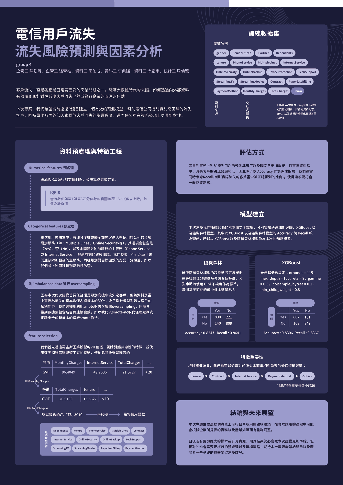

# [Group 4] Telco Customer Churn
客戶流失一直是各產業日常要面對的商業問題之一。隨著大數據時代的來臨，如何透過內外部資料有效預測和針對性減少客戶流失已然成為各企業的關注的焦點。
本次專案，我們希望能夠透過R語言建立一個有效的預測模型，幫助電信公司提前識別高風險的流失客戶，同時量化各內外部因素對於客戶流失的影響程度，進而使公司在策略發想上更具針對性。


## Contributors
|組員|系級|學號|工作分配|
|-|-|-|-|
|徐宏宇|資科三|110703056|幫忙撰寫程式| 
|周幼臻|統計三|110304030|海報設計| 
|張小明|資科碩二|xxxxxxxxx|團隊的中流砥柱，一個人打十個|

## Quick start
Please use the commands below to reproduce our analysis.
> Random Forest
```R
Rscript code/RandomForest-t001.R --input data/WA_Fn-UseC_-Telco-Customer-Churn.csv --output results/performance.tsv
```
> XGBoost
```R
Rscript code/XGboost-t001.R --input data/WA_Fn-UseC_-Telco-Customer-Churn.csv --output results/performance.tsv
```

## Folder organization and its related description
idea by Noble WS (2009) [A Quick Guide to Organizing Computational Biology Projects.](https://journals.plos.org/ploscompbiol/article?id=10.1371/journal.pcbi.1000424) PLoS Comput Biol 5(7): e1000424.

### docs
* Your presentation, 1122_DS-FP_groupID.ppt/pptx/pdf (i.e.,1122_DS-FP_group1.ppt), by **06.13**
* Poster

* Any related document for the project, i.e.,
> discussion log

> software user guide

### data
* Input
Source: [kaggle dataset](https://www.kaggle.com/datasets/blastchar/telco-customer-churn/data)
, Format: .csv
, Size: 977.5 kB

### code
* Analysis steps
透過IQR法進行離群值剃除，發現無顯著離群值。
* Which method or package do you use?
> Random Forest
```R
library(tidyverse)
library(data.table)
library(randomForest)
library(themis)
library(MASS)
library(caret)
library(car)
library(dplyr)
library(ranger)
```
> XGBoost
```R
library(tidyverse)
library(data.table)
library(randomForest)
library(themis)
library(MASS)
library(caret)
library(car)
library(dplyr)
library(ranger)
```
* How do you perform training and evaluation?
> Random Forest
```R
set.seed(111)
new_data <- smotenc(data, "Churn", k =5,  over_ratio = 1)# Oversampling

set.seed(111)
step_train_index <- createDataPartition(new_data$Churn, p = 0.8, list = FALSE)
step_train_data <- new_data[step_train_index,]
step_test_data <- new_data[-step_train_index,]

## 設置交叉驗證使用的超參數
random_control <- trainControl(method = "cv", number = 5)
grid <- expand.grid(
  mtry = c(2, 3, 4, 5, 6),
  splitrule = c("gini"),
  min.node.size = c(1, 3, 5, 7, 9)
)
```
> XGBoost
```R
set.seed(111)
new_data <- smotenc(data, "Churn", k =5,  over_ratio = 1)# Oversampling

set.seed(111)
step_train_index <- createDataPartition(new_data$Churn, p = 0.8, list = FALSE)
step_train_data <- new_data[step_train_index,]
step_test_data <- new_data[-step_train_index,]

## 設置交叉驗證使用的超參數
set.seed(111)
xg_control <- trainControl(method = "cv", number = 10)
xg_grid <- expand.grid(
  nrounds = c(100, 150),             
  max_depth = c(6, 8),               
  eta = c(0.1, 0.3),                 
  gamma = c(0, 0.1),                 
  colsample_bytree = c(0.8, 1.0),    
  subsample = c(0.8, 1.0),           
  min_child_weight = c(1, 3)         
)
```
* What is a null model for comparison?  Random Guess

### results
* What is your performance?
> Random Forest
```
Confusion Matrix and Statistics

          Reference
Prediction Yes   No
       Yes  890  221
       No   140  809

               Accuracy : 0.8247
                 95% CI : (0.8072, 0.8409)
    No Information Rate : 0.5000
    P-Value [Acc > NIR] : < 2.2e-16

                  Kappa : 0.6491

 Mcnemar's Test P-Value : 1.724e-14

            Sensitivity : 0.8641
            Specificity : 0.7854
         Pos Pred Value : 0.8016
         Neg Pred Value : 0.8526
             Prevalence : 0.5000
         Detection Rate : 0.4321
   Detection Prevalence : 0.5391
      Balanced Accuracy : 0.8247

       'Positive' Class : Yes
```
> XGBoost
```
Confusion Matrix and Statistics

          Reference
Prediction Yes   No
       Yes  862  181
       No   168  849

               Accuracy : 0.8306
                 95% CI : (0.8134, 0.8464)
    No Information Rate : 0.5000
    P-Value [Acc > NIR] : < 2.2e-16

                  Kappa : 0.6613

 Mcnemar's Test P-Value : 0.0033

            Sensitivity : 0.8367
            Specificity : 0.8243
         Pos Pred Value : 0.8269
         Neg Pred Value : 0.8349
             Prevalence : 0.5000
         Detection Rate : 0.4184
   Detection Prevalence : 0.5063
      Balanced Accuracy : 0.8306

       'Positive' Class : Yes
```
* Is the improvement significant?  Yes

## References
* Packages you use
* Related publications
